## Camera Calibration

---
 

> ### About Camera Calibration

- Camera Image는 3D 세계의 점을 2D 평면 이미지에 투사하여 획득됨
- Camera Calibration은 3D의 점이 2D에 정의되는 방법을 다룸
  - `핀홀(Pinhole) 카메라 모델`이 정의한 3D, 2D 간 변환 관계
  - 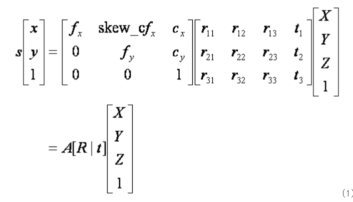 [식 1]
    - (X,Y,Z) : 월드 좌표계(world coordinate system) 상의 3D 점의 좌표
    - [R|t] : 월드 좌표계를 카메라 좌표계(camera coordinate system)로 변환시키기 위한 회전(rotation) / 이동(translation) 변환 행렬
      - [R|t]는 카메라 외부 파라미터(extrinsic parameter)
    - A : intrinsic camera matrix
      - A는 카메라 내부 파라미터(intrinsic parameter)
    - A와 [R|t]를 합쳐서 camera matrix 또는 projection matrix라고 부름
    - 핀홀 카메라 모델에서 카메라 모델의 렌즈 중심(초점)은 핀홀(pinhole)에 해당함

 

- 카메라 좌표계
  - 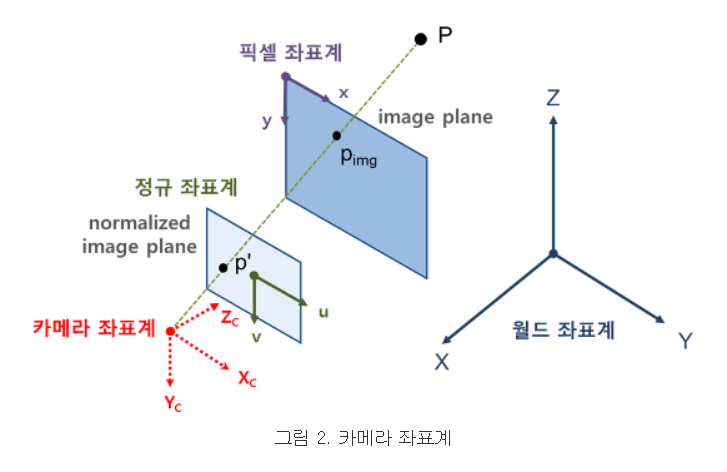
    - Camera Calibration은 3D 공간좌표와 2D 영상좌표 사이의 변환관계 또는 이 변환관계를 설명하는 파라미터를 찾는 과정

 

- 이미지는 카메라의 위치 및 방향 뿐만 아니라 카메라의 내부 조건에 의해 영향을 받음
- 즉, 이미지는 카메라 내부의 기구적인 부분에 의해 크게 영향을 받음
  - 내부 요인
    * 렌즈의 종류
    * 렌즈와 이미지 센서 사이의 거리
    * 렌즈와 이미지 센서 사이의 각도
  - Camera Calibration은 내부 요인들의 파라미터를 구하는 과정
  - 즉, 카메라 왜곡을 잡는 프로세스를 Camera Calibration이라 부름

 

- 카메라 외부 파라미터(extrinsic parameter) --> 카메라 위치 및 자세 파악
  - 카메라의 설치 높이, 방향(팬, 틸트) 등 카메라와 외부 공간과의 기하학적 관계에 연관된 파라미터
  - 카메라 좌표계와 월드 좌표계 사이의 변환 관계를 설명하는 파라미터
  - 두 좌표계 사이의 회전(rotation) 및 평행이동(translation) 변환으로 표현됨
  - 카메라 외부 파라미터를 구하기 위해서는 먼저 캘리브레이션 툴 등을 이용하여 카메라 고유의 내부 파라미터들을 구한 뒤,
  - 미리 알고 있는 또는 샘플로 뽑은 3D 월드 좌표 - 2D 영상 좌표 매칭 쌍들을 이용하여
  - 위의 [식 1]에서 변환 행렬을 구하면 됨
  - cf. OpenCV의 solvePnP 함수를 이용하여 계산하는 방법도 있음

 

- 카메라 내부 파라미터(intrinsic parameter)
  - 카메라의 초점 거리, aspect ratio, 중심점 등 카메라 자체의 내부적인 파라미터
    - 초점거리(focal length): fx, fy => 렌즈중심과 이미지센서(CCD, CMOS 등)와의 거리
      - 
        - 카메라 모델에서의 초점거리 f 는 pixel 단위로 표현됨
        - 이미지의 pixel은 이미지 센서의 cell 크기에 대응됨
        - 초점거리는 이미지 센서의 cell 크기에 대한 상대적인 값으로 표현됨
          - ex) 이미지 센서의 cell 크기가 0.1mm이고, 카메라의 초점거리가 f = 500px이라면,
          - ex) 카메라의 렌즈 중심에서 이미지 센서까지의 거리는 이미지 센서 cell 크기의 500배
          - ex) 즉, 50mm 라는 의미
        - 카메라 모델에서 초점거리가 f가 아닌, fx와 fy로 구분되는 경우가 있음
        - 이는, 이미지 센서의 물리적인 셀 간격이 가로 방향과 세로 방향이 서로 다를 수 있음을 모델링하기 위함
          - fx : 초점거리가 가로 방향 셀 크기의 몇 배인지 나타냄(px)
          - fy : 초점거리가 세로 방향 셀 크기의 몇 배인지 나타냄(px)
        - (현대의 카메라는 가로방향과 세로방향 셀 간격의 차이가 없으므로 f = fx = fy로 봐도 무방함)
        - 동일한 카메라로 캘리브레이션을 수행했을 때, 이미지 해상도를 1/2로 낮추면 캘리브레이션 결과의 초점거리도 1/2로 작아짐
        - 이미지 해상도를 1/2로 낮추면 이미지 센서의 2 x 2 셀들이 합쳐서 하나의 이미지 픽셀이 되므로 한 픽셀에 대응하는 물리크기가 2배가 됨
    
     

    - cf. 카메라 투영 모델(Camera Projection Model)
    - 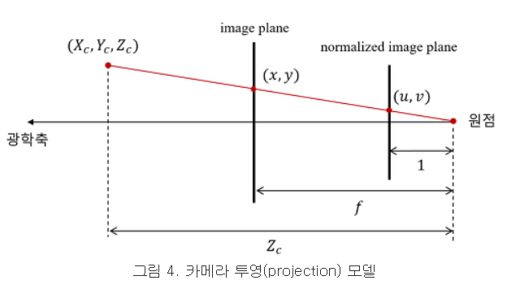
      - 초점으로부터 거리가 1(unit distance)인 평면을 normalized image plane이라고 부름
        - 해당 평면의 평면상의 좌표를 normalized image coordinate라고 부름
        - 단, normalized image plane은 가상의 이미지 평면
      - 카메라 좌표계 상의 한 점 (Xc, Yc, Zc)를 영상좌표계로 변환할 때,
        - 먼저 Xc, Yc를 Zc(카메라 초점에서의 거리)로 나누는 것은 이 normalized image plane 상의 좌표로 변환하는 것이며,
        - 여기에 다시 초점거리 f를 곱하면 우리가 원하는 이미지 평면에서의 영상좌표(pixel)가 나옴
      - 이미지에서 픽셀좌표는 이미지의 중심이 아닌 이미지의 좌상단 모서리를 기준(원점)으로 하기 때문에
        - 실제 최종적인 영상좌표는 여기에 (cx, cy)를 더한 값
      - `x = fxX/Z + cx, fyY/z + cy`

     

    - 주점(principal point): cx, cy
      - 카메라 렌즈의 중심 즉, 핀홀에서 이미지 센서에 내린 수선의 발의 영상좌표(단위는 픽셀)
      - 영상기하학에서는 단순한 이미지 센터보다는 principal point가 훨씬 중요
      - 영상의 모든 기하학적 해석은 이 주점을 이용하여 이루어짐

     

    - 비대칭계수(skew coefficient): skew_c = tanα
      - 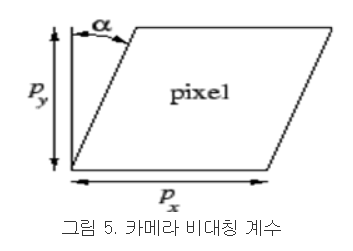
      - 이미지 센서의 cell array의 y축이 기울어진 정도
      - 현대의 카메라는 skew 에러가 거의 없으므로 카메라 모델에서 보통 비대칭 계수까지는 고려하지 않음
      - 즉, skew_c = 0

     

    - cf. 카메라 내부 파라미터들은 공개된 캘리브레이션 툴 등을 이용하면 비교적 쉽게 계산할 수 있음

 

- 핀홀(pinhole) 카메라 모델
  - 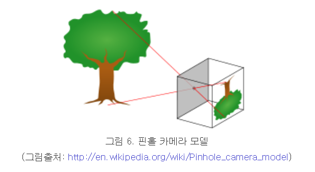
  - 하나의 바늘구멍(pinhole)을 통해 외부의 상이 이미지로 투영된다는 모델
  - 이때, 바늘구멍이 렌즈 중심에 해당하며, 이고셍서 뒷면의 상이 맺히는 곳까지의 거리가 카메라 초점거리임

 

- 자동 초점 조절(Auto-focusing)
  - Auto-focusing을 설정해두면, 계속 초점거리가 바뀔 수 있으므로 캘리브레이션에 적합하지 않음

- 영상 해상도
  - 영상 해상도를 바꿀 경우, 카메라 캘리브레이션 결과가 바뀔 수 있음에 유의
  - 카메라의 물리적인 초점거리나 이미지 센서의 크기는 변하지 않지만 한 픽셀이 나타내는 물리적 크기가 변하기 때문
  - 한 해상도에서만 캘리브레이션을 수행해도 다른 모든 해상도에 대한 파라미터 값을 구할 수 있게 됩니다. 렌즈왜곡계수는 동일하며,
  - fx,fy,cx,cy만 영상 해상도에 비례해서 조정해 주면 됨
  - (렌즈왜곡계수(k1, k2, p1, p2)는 normalized 좌표계에서 수행되므로 영상 해상도와 관계없이 동일함)

 
 

> ### REVIEW

- Camera Pinhole Model

- 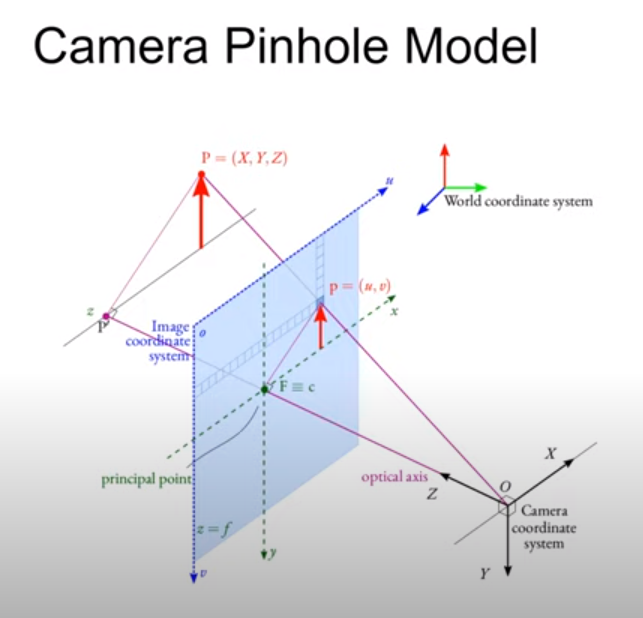

- 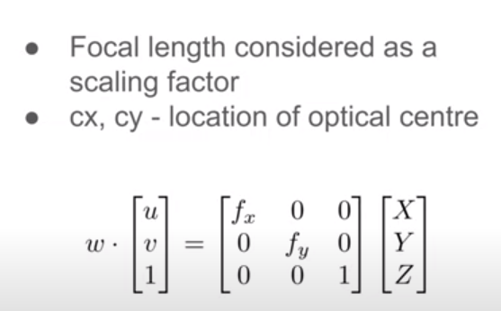

- 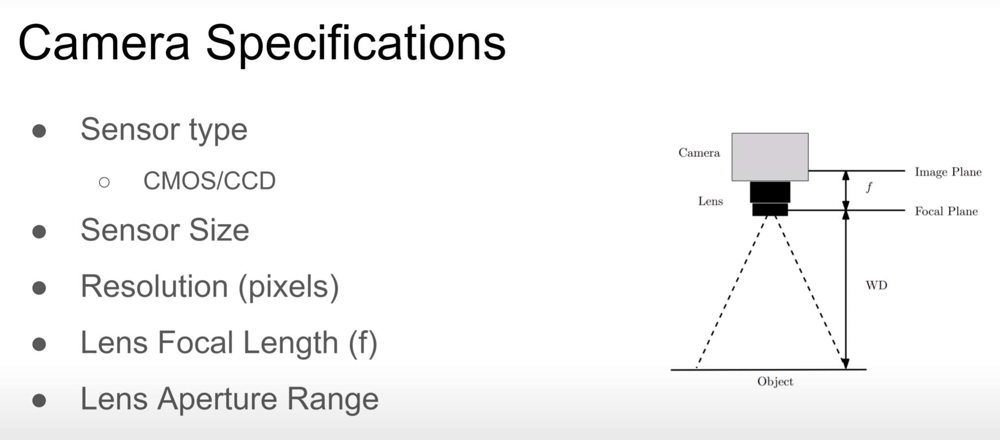
  - FOV = d * WD / f, where d is the sensor size
    - 단, 가로는 가로끼리, 세로는 세로끼리
    - FOV(Field of view)란 '시야'를 의미함
    - 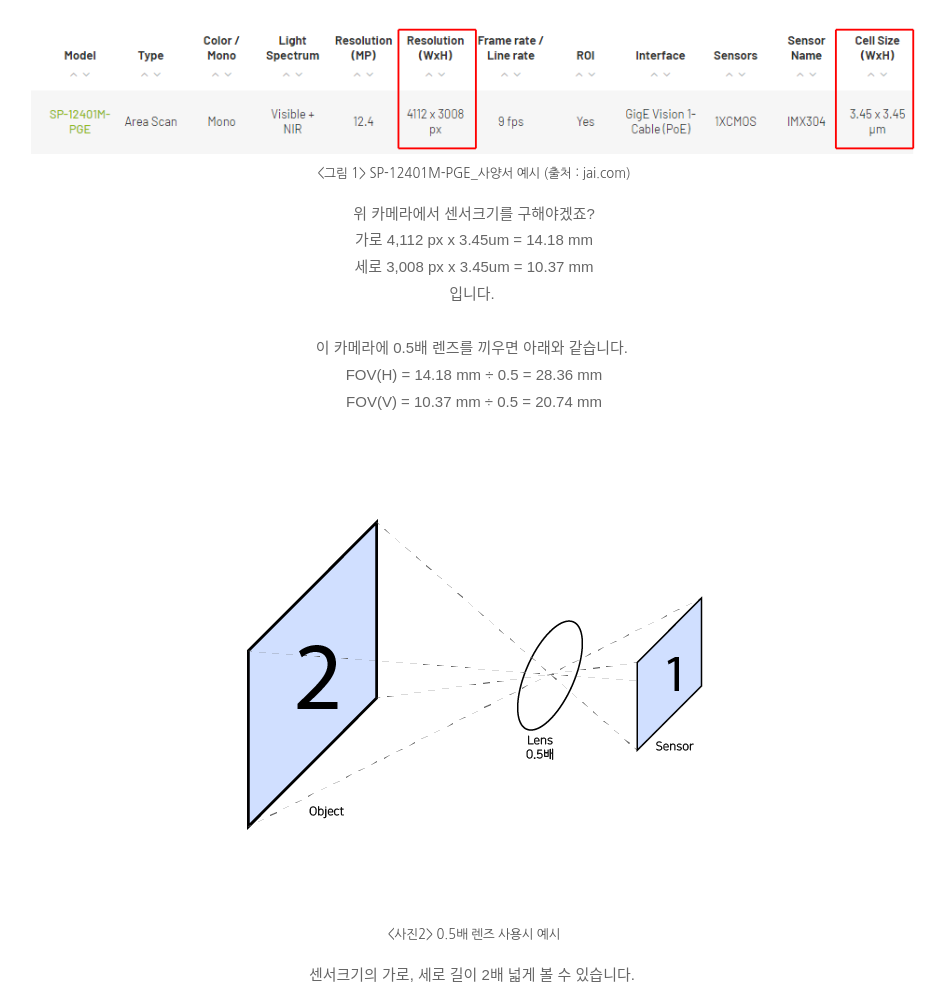

 

- cf. Focal은 '초점'을 의미

 

- Camera Geometry

- 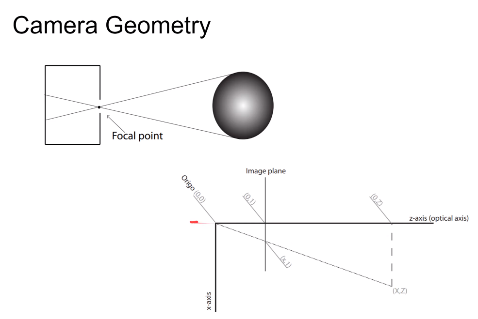

- 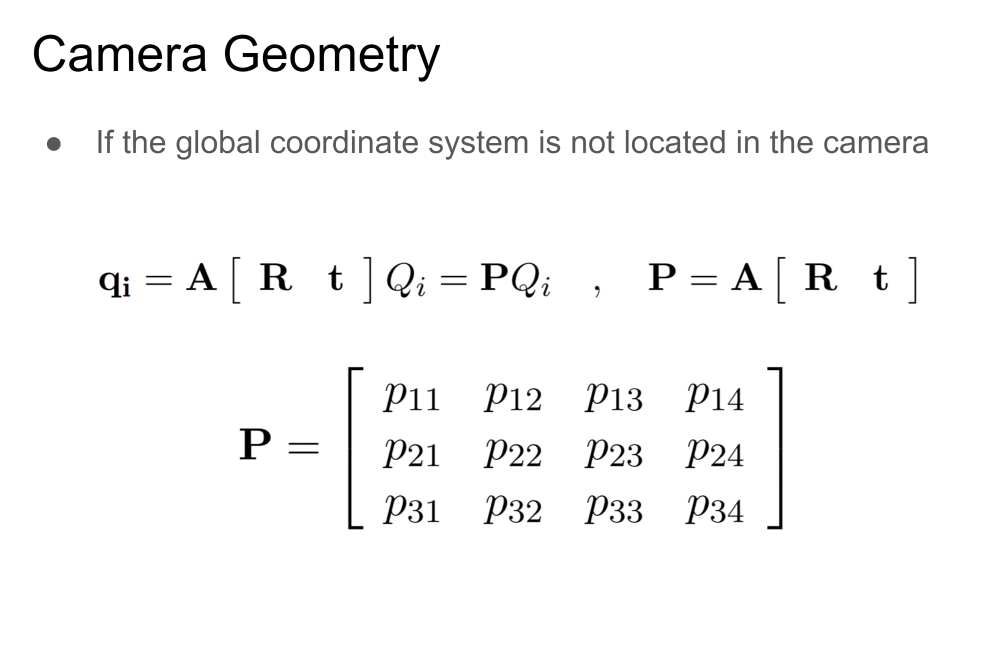

- 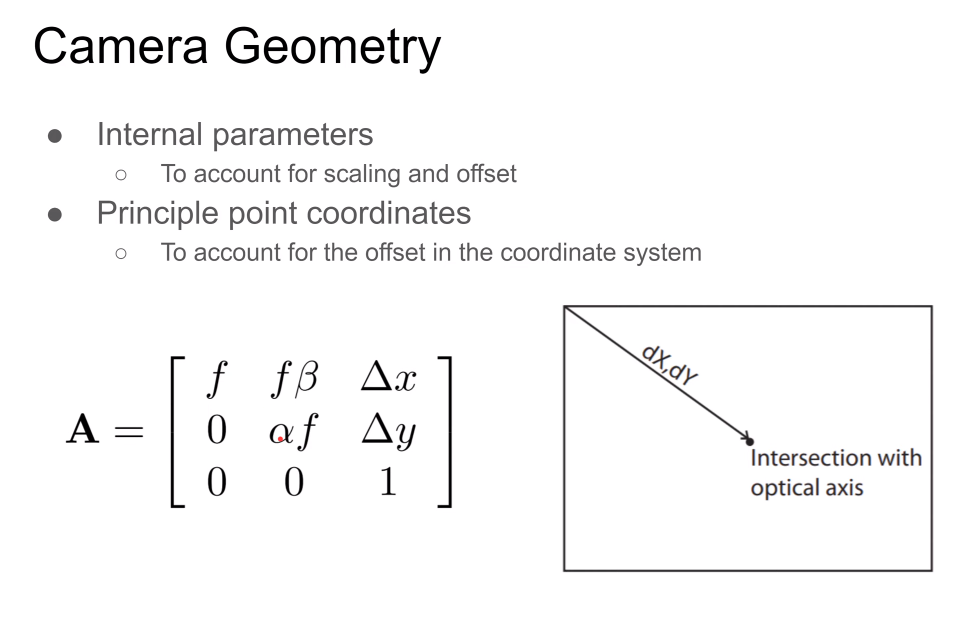
  - 카메라 왜곡을 줄이기 위함
  - f : lens focal length
  - alpha, beta : scaling factor(어떤 양을 늘리거나 줄이거나 또는 곱하는 수)
  - x, y coordinate(좌표) : principal point coordinates(주점 좌표)

 

- Skew And Aspect Ratio

- 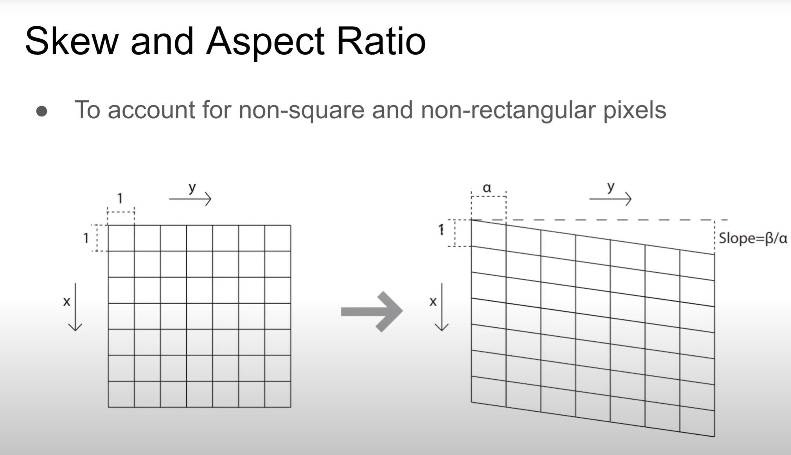

 

- FOV Calculation

- 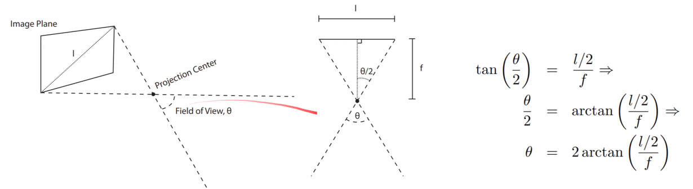

 

- Distortion

- 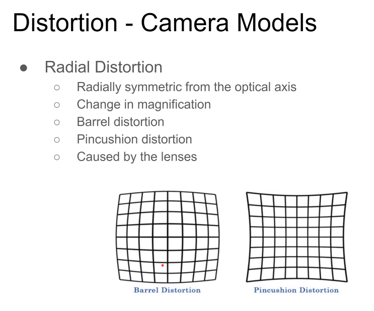

 

- cf. 탄젠트 계산
  - tan α = 높이(opposite) ÷ 밑변(adjacent)

 

- cf. 삼각 함수
  - 동경의 크기에 따라 변화하는 함수
  - 동경 위의 점과 원점, x축에 내리 발이 직각 삼각형을 이룸
  - 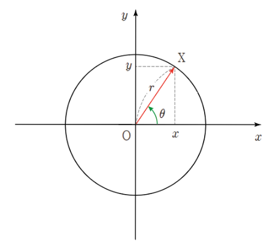
  - 각의 크기가 𝜽 인 동경 OX는 점 X(x, y)를 지나며, 선분 OX의 길이를 r이라 하면 삼각함수는 다음과 같음
  - 

 

- cf. 역삼각 함수
- 역삼각함수가 필요한 이유
  - 
- 역삼각 함수
  - 
  - 사인의 역함수는 arcsin로, 코사인의 역함수는 arccos로, 탄젠트의 역함수는 arctan로 나타냄

 
 

---
 

> ### References

- https://docs.opencv.org/4.2.0/d6/d55/tutorial_table_of_content_calib3d.html
- https://www.youtube.com/watch?v=ZI9uZ9EEeYQ
- https://darkpgmr.tistory.com/32#
- https://junsk1016.github.io/opencv/Calibration-%EC%9D%B4%EB%A1%A0/
- https://www.youtube.com/watch?v=-9He7Nu3u8s
- https://blog.naver.com/fainstec_sales/221643523491
- https://calcproject.tistory.com/415
- https://ko.khanacademy.org/math/geometry/hs-geo-trig/hs-geo-solve-for-an-angle/a/inverse-trig-functions-intro
- http://www.gisdeveloper.co.kr/?p=6868