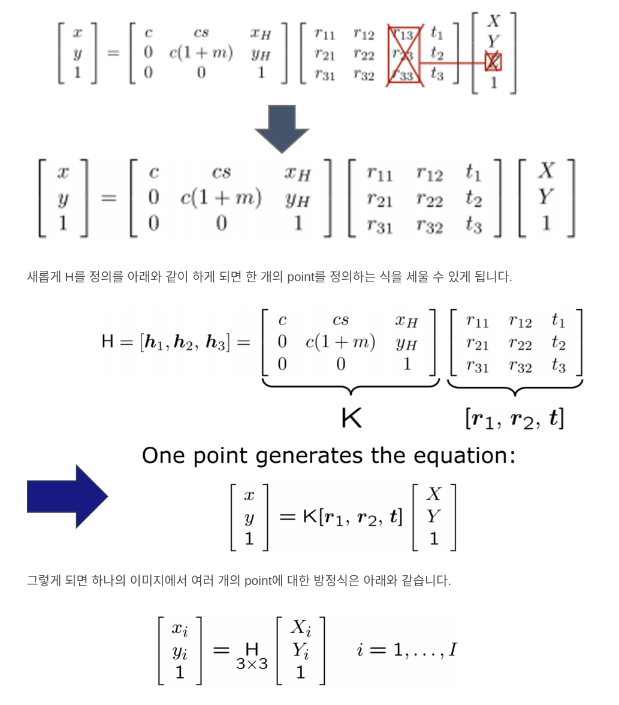

## Zhang's Method

---
 

> ### About Zhang's Method

- 카메라의 외부 파라미터를 고려하지 않고 내부 파라미터를 구하는 방법
- Checkboard를 이용하여 알고 있는 3D point를 사용하는 것이 아닌 Checkboard 패턴을 이용해 내부 파라미터를 구하는 방법
- Checkboard의 코너를 world coordination system으로 설정을 하는 것
  - (1) 먼저 corner detector로 checkboard의 모든 코너를 검출
  - (2) 그 후 검출된 corner가 3D에 있지만 어디 있는지 알 수 없으므로
  - (3) 위의 트릭을 사용해 모든 이미지에 고유한 좌표계를 정의하는 것
  - (4) 즉, 모든 점이 체크보드 위에 있으며, 3D World의 모든 points들이 z=0을 갖게 됨

- 위의 메서드에 따라 z=0을 만들면 `projection matrix`는 다음과 같이 변경됨
  - 

 
 

---
 

> ### References

- https://junsk1016.github.io/opencv/Zhang's-Method/