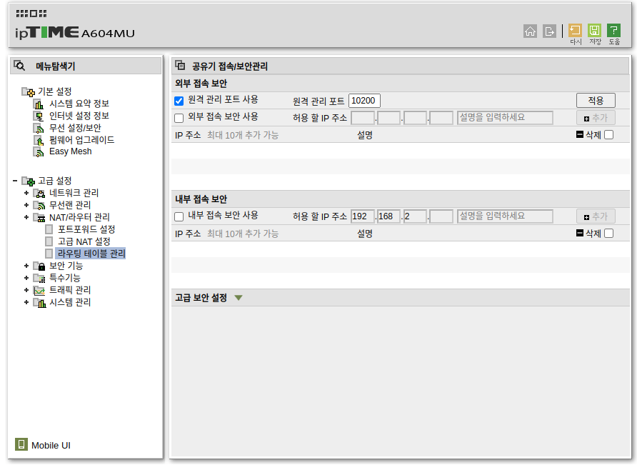
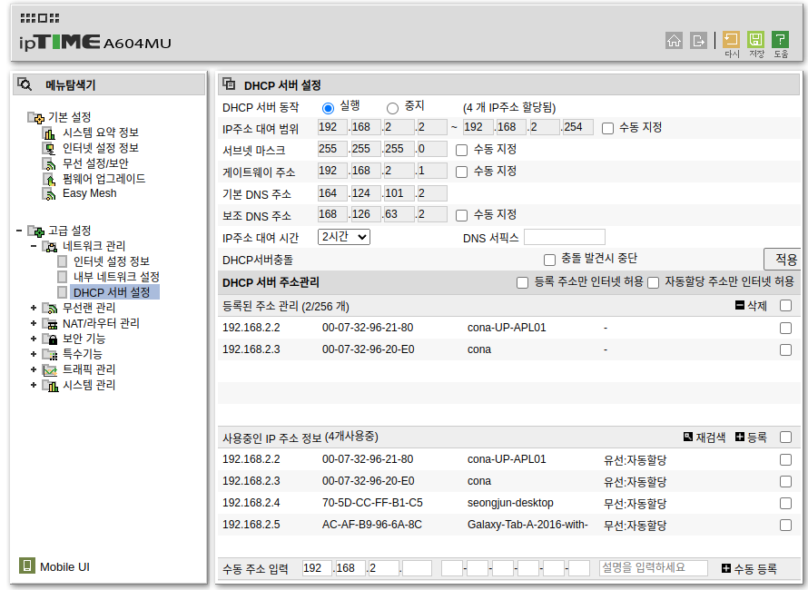
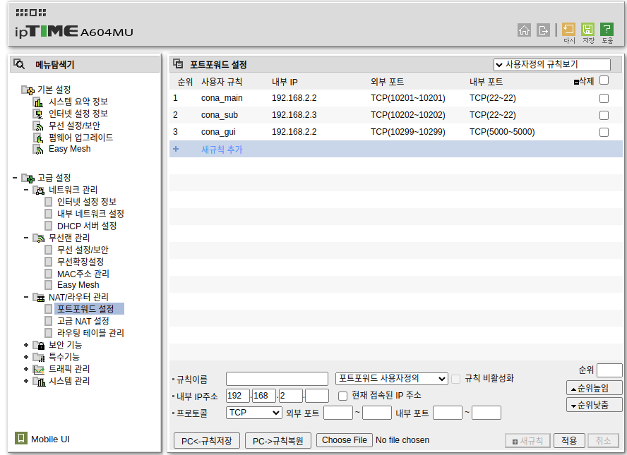
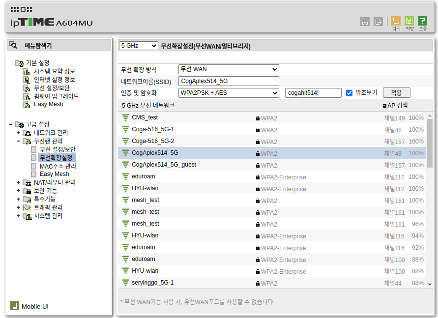

> ## AP 세팅

---
 

> ### 아이디 및 비밀번호 변경

- 시스템 관리 > 관리자 설정에서
- id : admin, pw : admin 에서 id : cona, pw : cona 로 변경

 

> ### 언어 변경

- 시스템 관리 > 기타 설정에서
- 언어 설정을 한국어로 변경

 

> ### 와이파이 이름 변경

- 무선랜 관리 > 무선 설정/보안에서
- 네트워크 이름 ex) Solution_T2_5G
- 인증 및 암호화는 권장되는 방식을 선택
- 암호 ex) conacona
- 5G와 2G 모두 설정

 

> ### 내부 IP 주소 변경

- 고급 설정 > 네트워크 관리 > 내부 네트워크 설정에서
- 내부 IP 주소를 192.168.2.1로 변경

 

> ### 원격 관리 포트 사용

 

> ### DHCP 서버 설정

 

> ### 포트포워딩 설정

 

> ### 외부 인터넷 접속

