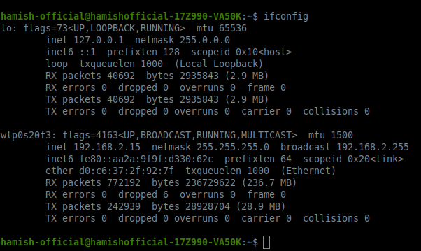
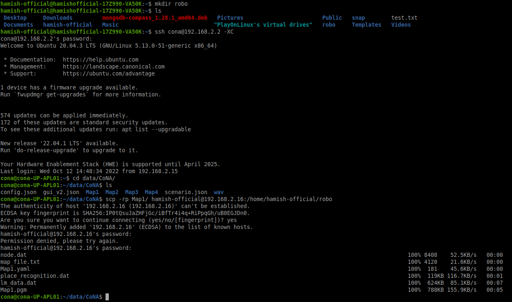
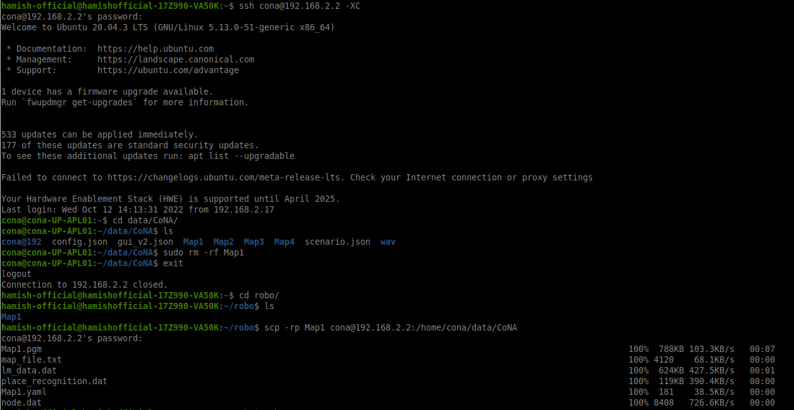
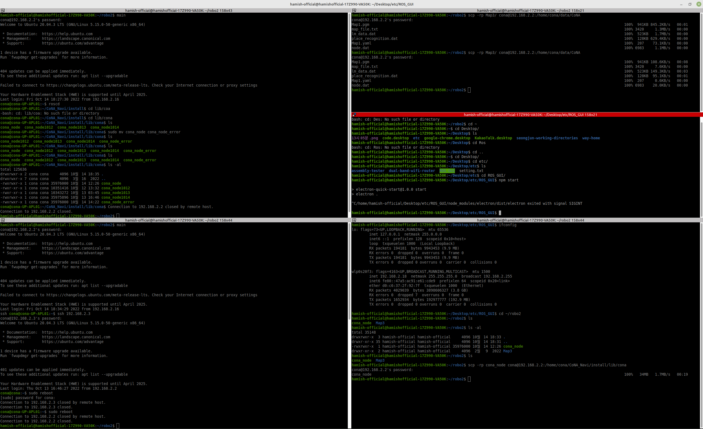

> ## ssh를 이용해 서로 다른 컴퓨터에 파일 또는 폴더 옮기기

---
 

> ### 1단계

- sudo apt-get install openssh-server
- 두 대의 컴퓨터에 연결된 와이파이를 일치시킴
- ifconfig를 통해 각 컴퓨터의 아이피를 확인함

 

> ### 2단계

- 복사하고자 하는 폴더 또는 파일을 설정
- 핵심 명령어 : scp -rp {복사하고자 하는 폴더명 또는 파일명} {ssh로 연결할 사용자명} @ {ifconfig로 찾은 아이피 주소} : {복사할 경로}
- 핵심 명령어 예시 : scp -rp Map1/ hamish-official@192.168.2.16:/home/hamish-official/robo

 

> ### 3단계

- 서빙고 노드 지우고 다른 서빙고에서 노드 복사해오는 방법

